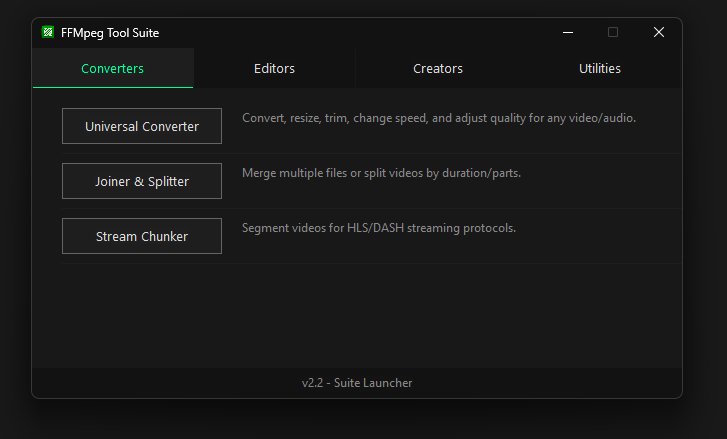
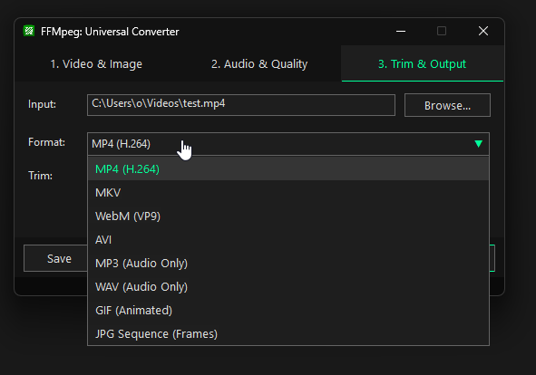
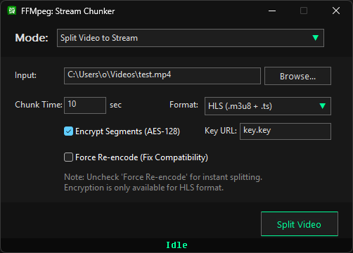
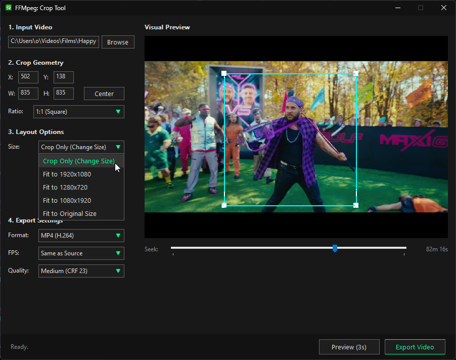
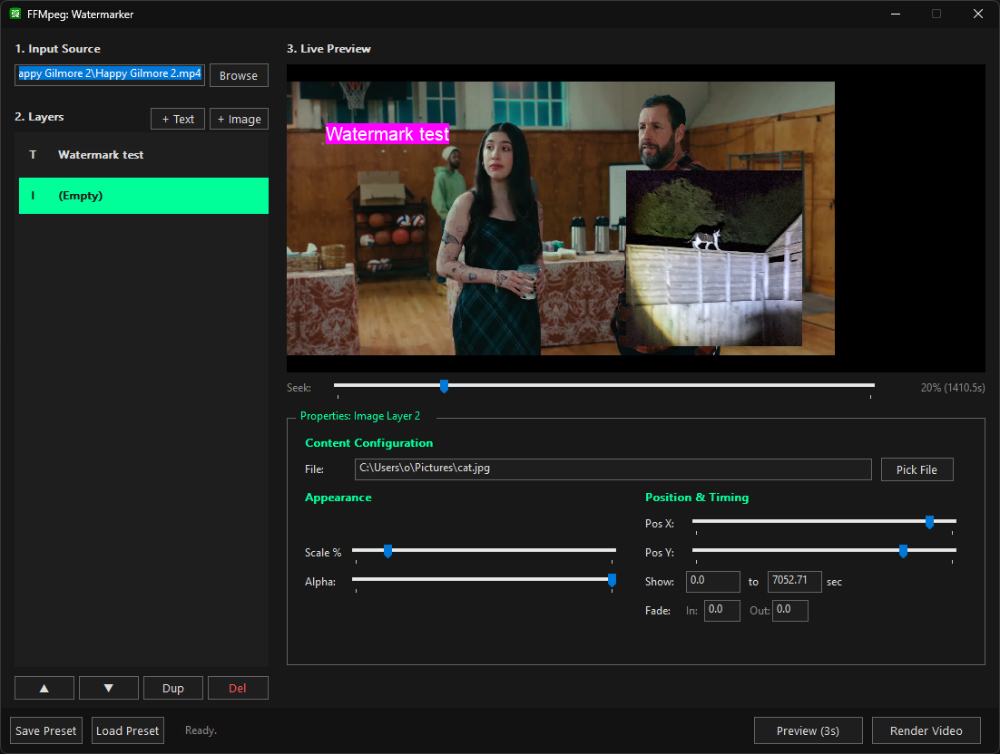
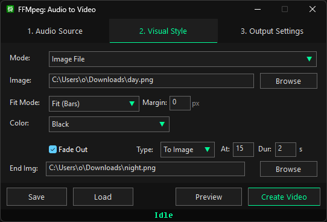
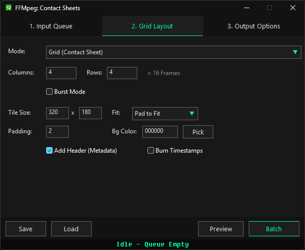

# FFmpeg Tool Suite

A comprehensive graphical interface for FFmpeg, designed for Windows. This suite provides a modular collection of tools to perform complex video and audio manipulation tasks without interacting with the command line.

## Table of Contents

- [Overview](#overview)
- [Installation and Requirements](#installation-and-requirements)
- [Usage](#usage)
- [Tool Breakdown](#tool-breakdown)
    - [Converters](#converters)
    - [Editors](#editors)
    - [Creators](#creators)
    - [Utilities](#utilities)
- [Key Features Summary](#key-features-summary)
- [Build System](#build-system)

## Overview

The FFmpeg Tool Suite is built using AutoHotkey (v2) to wrap powerful FFmpeg filters and commands into user-friendly GUIs. Each tool functions independently but is accessible via a central Launcher. The suite emphasizes workflow efficiency with features like visual previews, preset management, and drag-and-drop support.

## Installation and Requirements

### System Requirements
- **OS:** Windows 10 or Windows 11 (Dark Mode support included).
- **Runtime:** AutoHotkey v2.0 (if running from source).

### FFmpeg Dependency
The suite requires `ffmpeg.exe` and `ffprobe.exe` to function. The tools will search for these executables in the following order:
1. The script's directory.
2. System Environment Path.

### Running the Suite
1. Ensure FFmpeg binaries are accessible.
2. Run `Launcher.ahk` to open the main menu.

## Usage

### Launcher

The `Launcher.ahk` file acts as the central hub. Tools are categorized by function. 
*   **Shortcuts:** `Ctrl + W` closes any active tool window.
*   **Safety:** Closing a tool while a job is running will trigger a confirmation prompt to prevent accidental data loss.

### CLI Arguments
Tools can be launched directly without the main menu by passing the tool name as an argument to the launcher or compiling them individually.

## Tool Breakdown

### Converters

**Universal Converter**

A general-purpose tool for transcoding video and audio.
*   **Video Scaling:** Resize to standard resolutions (1080p, 720p) or custom dimensions.
*   **Speed Control:** Adjust playback speed (0.5x to 4.0x) or "Fit to Duration" to force a video to match a specific length.
*   **Trimming:** Cut video segments by start and end timestamps.
*   **Presets:** Save and load conversion configurations.

**Joiner & Splitter**
*   **Joiner:** Concatenate multiple video files. Includes a "Smart Join" option to re-encode files with mismatched codecs or resolutions.
*   **Splitter:** Segment videos into N equal parts, split by time duration (e.g., every 30 seconds), or extract specific time ranges.

**Stream Chunker**

Designed for HLS (HTTP Live Streaming) and DASH workflows.
*   **Splitting:** Converts video into `.m3u8` or `.mpd` playlists with segment files.
*   **Encryption:** Supports AES-128 encryption generation for HLS segments.
*   **Joining:** Reassembles streaming playlists back into a single video file.

### Editors

**Crop Tool**

Visually crop video footage.
*   **Visual Preview:** Interactive crop box with drag-and-drop handles.
*   **Aspect Ratio Locking:** Lock cropping area to 16:9, 4:3, 1:1, or 9:16.
*   **Padding:** Option to fill the remaining area with a solid color or blurred background instead of resizing.

**Visual Filters**
Apply restoration and enhancement filters.
*   **Restoration:** Deinterlacing (YADIF/BWDIF), Inverse Telecine, Deblocking, and Denoising (HQDN3D/NLMeans).
*   **Enhancement:** Sharpening (Unsharp Mask, CAS), Color Equalization (Brightness, Contrast, Saturation).
*   **Preview:** Generate 5-second previews to verify settings before export.

**Stabilizer Tool**
Stabilize shaky handheld footage using a two-pass analysis.
*   **Analysis Mode:** Generates motion vectors.
*   **Visualizer:** Interactive preview showing the estimated crop/zoom "safe area" based on stabilization strength.
*   **Comparison:** Generate a side-by-side video comparing the original vs. stabilized result.

**Motion Interpolation**
Generate intermediate frames to smooth out video or create slow motion (Optical Flow).
*   **Frame Rate Conversion:** Convert 30fps content to 60fps or 120fps.
*   **Slow Motion:** Generate smooth slow-motion video without stuttering.
*   **Algorithms:** Configurable motion estimation (Bidirectional/Bilateral) and compensation (AOBMC/OBMC).

**Watermark Tool**

Advanced multi-layer overlay system.
*   **Visual Editor:** Drag-and-drop positioning for text and image layers on a live preview canvas.
*   **Timeline Control:** Set start/end times and fade-in/out durations for each layer.
*   **Variables:** Support for dynamic text (e.g., filename, timestamps, frame count).
*   **Preset Support:** Save complex layer configurations.

### Creators

**Screen Recorder**
*   **Capture Areas:** Select specific monitors, draw custom regions, or capture the full virtual screen.
*   **Timelapse Mode:** Record directly to an image sequence or low-framerate video.
*   **Formats:** Output to MP4, MKV, or GIF.

**Time-Lapse Creator**
*   **Sequence Stitching:** Convert folders of images into high-quality video.
*   **Sorting:** Sort images by name or modification date to ensure correct frame order.
*   **Resizing:** Downscale high-resolution photos (e.g., 4K/8K) to standard video resolutions.

**Audio to Video**

Create video files from audio tracks.
*   **Visual Modes:** Use a static image, a solid color, or text-over-color.
*   **Fit Modes:** Handle image aspect ratios with padding, cropping, or blurred backgrounds.
*   **Fading:** Visual fade-in/out options.

**Contact Sheets**

Batch processor for generating video thumbnails and previews.
*   **Batch Queue:** Process multiple video files in sequence.
*   **Layouts:** Create grids (Contact Sheets), Filmstrips (Horizontal/Vertical), or single thumbnails.
*   **Metadata:** Option to burn in file details (resolution, duration, size) onto the header.
*   **Burst Mode:** Capture frames at specific time intervals.

### Utilities

**Media Inspector**
A GUI wrapper for `ffprobe`.
*   **Analysis:** Displays detailed container, stream, and codec information.
*   **Structure:** Tree-view visualization of metadata tags.

**Audio Manager**
*   **Extraction:** Rip audio tracks from video files (supports re-encoding or stream copying).
*   **Replacement:** Replace, add, or remove audio tracks from a video container without re-encoding the video stream.

**Subtitle Manager**
*   **Conversion:** Convert between SRT, VTT, ASS, and SSA formats.
*   **Extraction:** Demux subtitle tracks from MKV/MP4 files.
*   **Burn-in:** Hardcode subtitles into the video (Hardsubs) or embed them as tracks (Softsubs).

**Auto-Analysis**
Detect specific events within media files.
*   **Detection Modes:** Scene changes, silence periods, black frames, and freeze frames.
*   **Actions:** Export a text report of timestamps or automatically split the video at detected points.

## Key Features Summary

| Feature | Supported Tools |
| :--- | :--- |
| **Visual Preview** | Watermark, Crop, Stabilizer, Filter, Motion Interpolation, AudioToVideo |
| **Batch Processing** | Contact Sheet Maker |
| **Presets (Save/Load)** | Watermark, Simple Converter, Motion Interpolation, TimeLapse, Stabilizer |
| **Stream Copy** | Audio Tool, Subtitle Tool, Stream Chunker, Joiner/Splitter |
| **Drag & Drop** | All Tools |

# Building / Compiling

Included is `build.ahk`, a utility to compile the suite into standalone executables.

1.  **Clear Build Directory:** Cleans up previous builds.
2.  **Compilation:** Uses `Ahk2Exe` to compile the Launcher and included scripts.
3.  **Shortcuts:** Generates `.lnk` shortcuts for every specific tool in the suite, pointing to the main executable with the correct arguments.

*Note: Requires `Ahk2Exe` to be present in the parent directory or standard installation path.*
